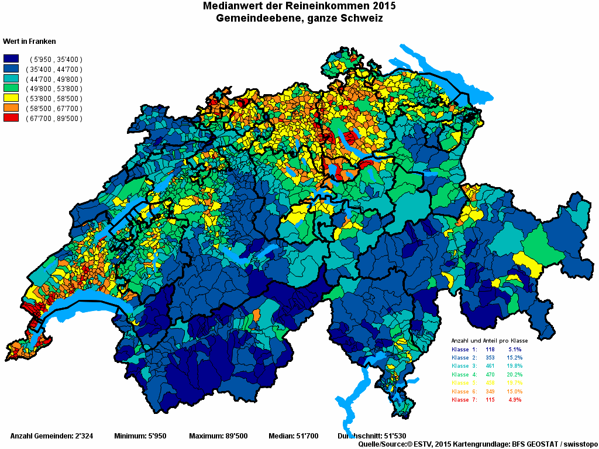
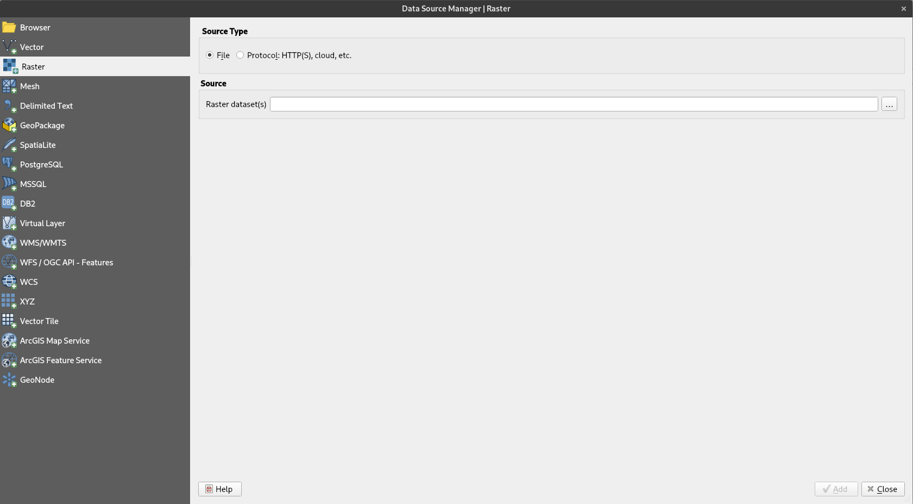

class: title-slide, center, middle
```{r, echo = FALSE}
# https://stackoverflow.com/questions/25646333/code-chunk-font-size-in-rmarkdown-with-knitr-and-latex
def.chunk.hook  <- knitr::knit_hooks$get("chunk")
knitr::knit_hooks$set(chunk = function(x, options) {
  x <- def.chunk.hook(x, options)
  ifelse(options$size != "normalsize", paste0("\\", options$size,"\n\n", x, "\n\n \\normalsize"), x)
})
```

```{r, echo = FALSE, results="asis"}
cat('# ', rmarkdown::metadata$title)
```

```{r, echo = FALSE, results="asis"}
cat('## ', rmarkdown::metadata$subtitle)
```

```{r, echo = FALSE, results="asis"}
cat('### ', rmarkdown::metadata$author)
```

```{r, echo = FALSE, results="asis"}
cat('#### ', rmarkdown::metadata$institute)
```

```{r, echo = FALSE, results="asis"}
cat(rmarkdown::metadata$date)
```
.footnote[
.right[
.tiny[
based on [Datapolitan-Training/qgis-training](https://github.com/Datapolitan-Training/qgis-training)
]
]
]
---
## Content yet to come

---
## aims and objectives

### aim
* Teach skills required for a complete GIS workflow
  * from data acquisition to analysis and cartographic output

### objectives
* Introduction to GIS and fundamental cartography
* Practical work with archaeological (spatial) data
* Spatial analyses
* Creation of "presentable" maps with different levels of information
* Learning the basics for later autonomous work with GIS

---
## outcomes
--

+ You will be familiar with the foundational concepts in spatial analysis and mapmaking
--

+ You will understand the structure and purpose of GIS
--

+ You will be practiced in applying spatial concepts to real-world problems
--

+ You will be able to conduct spatial analyses
--

+ You will produce decent maps

---
## schedule

.smaller[
| | |
|-|-|
| **16/09/20** | Introduction |
| **23/09/20** | Working with QGIS |
| **30/09/20** | Making Maps |
| **07/10/20** | Georeferencing |
| **14/10/20** | Handling Spatial Data |
| **21/10/20** | Densities |
| **28/10/20** | Interpolation |
| **04/11/20** | Making nicer Maps |
| **11/11/20** | Terrain Data |
| **18/11/20** | Site Catchment Analysis |
| **25/11/20** | Visibility Analysis |
| **02/12/20** | Least Cost Path Analysis |
| **09/12/20** | Kriging |
| **16/12/20** | Predictive Mapping |
]

The programme may change or shift depending on how well we progress.
---
## organisational information

* Assessment:
  * active participation
  * homework

* You will need
  * to take part regularily
  * to make the homework
  * some frustration threshold...

If you do your homework at home, than you need a computer with QGIS:
https://qgis.org/de/site/forusers/download.html

Otherwise, Room -120 will be accessible for you, we need to give your credentials for the Hausdienst
Please fill in the list ;-)

All slides and additional (video) Material will be accessible via the course home page
https://martinhinz.github.io/gia_hs_2020

---
class: inverse, middle, center
# who are you?

## Please give a short statement about

**What is your name?**

**What is your background in archaeology/computer/GIS?**

**One thing you hope to get out of the course**

*Describe a map you've seen/created/used recently and why it was interesting to you*

*Do you have any advice how we make this a successful seminar?*

---
class:center,middle
# Why Do We Create Maps?

---
class:center,middle
#Types of Maps

---

#General Reference Maps

--

+ Show important physical features of an area
--

+ Include natural and man-made features
--

+ Usually meant to help aid in the navigation or discovery of locations
--

+ Usually fairly simple
--

+ Can be stylized based on the intended audience (tourists vs locals)

---

class:center,middle

#####Source: https://map.schweizmobil.ch/
---

#Thematic Maps

--

+ Focuses on a specific theme or subject area
--

+ Features on the map represent the phenomenon being mapped
--

+ Spatial features used for reference
---
class:center,middle


#####Source: https://www.meteoschweiz.admin.ch/

---
class:center,middle
## Choropleth


#####Source: Pinterest... 

---
class:center,middle
## Choropleth



#####Source: http://www.estv2.admin.ch/

---
class:center,middle
## Choropleth


#####Source: https://www.srf.ch/news/schweiz/interaktive-karte-so-ungleich-ist-das-einkommen-in-der-schweiz-verteilt

---
class:center,middle

#Area Cartogram – World Population

#####Source: http://www.visualcapitalist.com/

---
class:center,middle

#Area Cartogram – European Unemployment rate

#####Source: http://www.viewsoftheworld.net/

---
class:center,middle

## Distribution Map


.caption[Source: Steuer 1998]
---
class:center,middle
## "Cultural" Map


.caption[Terberger et al. 2014]
---
class:center,middle
## "Genetic" Map


.caption[Kayser et al. 2005]
---

class:center,middle,inverse
# Basic Map Elements

---
class:center,middle

## Points  

.caption[http://docs.qgis.org/2.8/en/docs/gentle_gis_introduction/vector_data.html#overview]

---
class:center,middle

## Lines

.caption[http://docs.qgis.org/2.8/en/docs/gentle_gis_introduction/vector_data.html#overview]

---
class:center,middle

## Polygons

.caption[http://docs.qgis.org/2.8/en/docs/gentle_gis_introduction/vector_data.html#overview]

---

class:center,middle
# How do we make maps?

---

## Geographic Information System (GIS)
.pull-left[

> A geographic information system (GIS) is a system designed to capture, store, manipulate, analyze, manage, and present spatial or geographic data. - Wikipedia
]

.pull-right[

]

### Or more simply

> In a GIS, you connect _**data**_ with _**geography**_.
[GISgeography.com](http://gisgeography.com/what-gis-geographic-information-systems/)

---

## Geographic Information Systems (GIS)
--

+ Create interactive queries (user-created searches)
--

+ Analyze spatial information
--

+ Edit data in maps
--

+ Present the results of all these operations

.right[

]
---
## QGIS

- a free and open source GIS software
- https://www.qgis.org/
- You might like to installed it... ;-)

.center[

]

.right[

]
---

<!-- opening shapefile -->
#Let's Get Started
1. [Click this link](data/points.zip) and download the file to your desktop
2. Unzip the file
3. [Click this link](data/background.tiff) and download the other file also to your desktop
3. Open QGIS


---

#QGIS Getting Started


---

# QGIS Getting Started


---


---

# QGIS Getting Started


---
<!-- Styling -->
## Styling Features
+ Right-click the layer and select the Properties option
+ Select "Symbology," and style as you like
        
.pull-left[

]
.pull-right[

]
 
---
## Add background
.pull-left[

]
.pull-right[

]

---
## Add background

---

# Add labels to data
+ From Properties, select "Labels", "Show labels"
+ Select attribute for label (this time "label")
+ Style as you like

.pull-left[

]
.pull-right[

]

---
# What We've Covered
--

+ What is GIS
--

+ Basic GIS concepts and tools
--

+ Adding, styling, and labeling data in QGIS

---

# Homework
+ Style the polygons however you'd like
+ Change the outline color or add a pattern
+ Style the labels
+ Change the font, the font size, or other attributes
+ Send me a screenshot

---
class: inverse, middle, center
# Any questions?


.caption[Source: https://www.instagram.com/sadtopographies]

.footnote[
.right[
.tiny[
You might find the course material (including the presentations) at

https://github.com/MartinHinz/gia_hs_2020

You can see the rendered presentations at

http://martinhinz.github.io/gia_hs_2020

You can contact me at

<a href="mailto:martin.hinz@iaw.unibe.ch">martin.hinz@iaw.unibe.ch</a>
]
]
]
