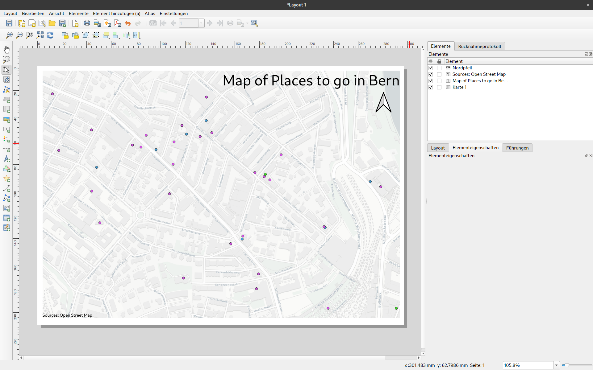

class: title-slide, center, middle
```{r, echo = FALSE}
# https://stackoverflow.com/questions/25646333/code-chunk-font-size-in-rmarkdown-with-knitr-and-latex
def.chunk.hook  <- knitr::knit_hooks$get("chunk")
knitr::knit_hooks$set(chunk = function(x, options) {
  x <- def.chunk.hook(x, options)
  ifelse(options$size != "normalsize", paste0("\\", options$size,"\n\n", x, "\n\n \\normalsize"), x)
})
```

```{r, echo = FALSE, results="asis"}
cat('# ', rmarkdown::metadata$title)
```

```{r, echo = FALSE, results="asis"}
cat('## ', rmarkdown::metadata$subtitle)
```

```{r, echo = FALSE, results="asis"}
cat('### ', rmarkdown::metadata$author)
```

```{r, echo = FALSE, results="asis"}
cat('#### ', rmarkdown::metadata$institute)
```

```{r, echo = FALSE, results="asis"}
cat(rmarkdown::metadata$date)
```
.footnote[
.right[
.tiny[
based on [Datapolitan-Training/qgis-training](https://github.com/Datapolitan-Training/qgis-training)

You can download a [pdf of this presentation](gis_in_archaeology_03.pdf).
]
]
]

---
<!-- opening shapefile -->
#Let's Get Started
1. [Click this link](data/going_out_in_bern.zip) and download the 'going_out_in_bern' data to your desktop
2. [Click this link](data/bicycle_rent.csv) and download the csv data to your desktop
3. [Click this link](data/background.tiff) and download the background map also to your desktop
4. Open QGIS
5. Start a new project and Add all layers 

---

# Selecting Points


---

# Selecting Points


--
+ Click the point


---

# Selecting Points


---

# Selecting Points - Attribute Table


---
# Selecting Points - Saving Selection


---

# Selecting Points - Saving Selection

+ If we wanted to reproject the data into a different CRS, we could do that here

--


--

+ Pick the new projection in the CRS field (like when we imported the CSV)
+ You can also export your CSV file as shape file - making further adding to the map easier

---

# Selecting Points - Saving Selection as CSV

+ If we wanted analyse our data using eg. statistical software, we also can export as csv.

--


--

+ If you like to export the coordinates, you can select that at 'Layer options'

---
# Styling points according to data
+ can be used to map different categories within a vector dataset
+ is available for all kinds of vector data

---
# Styling points according to data


+ Select Properties
+ Go to Symbology and change 'Single Symbol' to 'Categorised'
---
# Styling points according to data


+ Select the data (column) that represents your categories
+ Select 'Classify'
+ Enjoy the result
+ You can the colors according to your needs

---

## Installing Plugins
+ QGIS has many third party functionality available
+ We will use some of them in the course
+ let's get some Background with QuickMapServices


---
## Basemaps (QuickMapServices)

+ Satellite imagery
+ Map services
+ ...
+ Fast and easy way to get background maps


---

# Setting Up QuickMapServices Plugin
+ Go to the Settings Menu


---

# Setting Up QuickMapServices Plugin
+ Get the contributed packs


---

# Setting Up QuickMapServices Plugin
+ Revel in all the beautiful base maps
.right[

]
---
# Choosing a Base Map
--

+ Think about what someone reading your map needs to see for context
--

+ Think about how the base map interacts with the data on your map

---

# Base Maps - Hierarchy
--

+ If your data is the most important part of the map, make sure it looks more important than the base map
--

+ Avoid base maps that strongly emphasize features that aren't relevant on your map

---

# Base Maps - Colors
--

+ Choose base maps with colors that complement the colors on your map
--

+ The contrast between the color on your map and the color on the base map should be enough to make your layers clearly visible

---

# Base Maps - Scale


#### Source: http://go.owu.edu/~jbkrygie/krygier_html/geog_222/geog_222_lo/geog_222_lo04.html

---

# Base Maps - Scale
+ Base maps show different levels of detail at different scales
--

+ Make sure the level of detail is appropriate to your map

---

## Scale


---

## Scale


---

# Your Turn
+ Find a good base map for your data
+ Think about hierarchy, color, and scale
+ Don't be afraid to play around

---
## Print Composer
--

+ How you make exportable and printable maps in QGIS
--

+ Able to add map elements (legends, scales, text, etc)

---

## Create a new print composer


--


---

## You are greeted with a blank slate


---

## Add New Map tool will add your current map

--


---

## Customize item properties on the right
.center[

]
---

## Don't forget a title and your sources


---
## Adding North Arrow



+ You can select from multiple arrow types
---
## Adding Scale bar


---
## Adding Scale bar

+ You can also select and customize different styles of scale bars

.center[

]

---

## There are a few exporting options

.center[

]

---

## Now you can share your map or print it

.center[

]

---

# Print Composer Problems
+ Map extent -> "Use current map extent"
+ Moving map around -> Adjust with arrows

---

# What We've Covered
--

+ Selecting features
--

+ Exporting data
--

+ Making Maps

---

# Homework
+ Filter for service requests in your borough
+ Try and find something interesting
+ Change the style of the point, either to a different shape, color, or icon
+ Export your selection as a new shapefile
+ Get a background map
+ Make a decent Map
+ Send me an exported map (png or pdf)

---
class: inverse, middle, center
# Any questions?


.caption[Source: https://www.instagram.com/sadtopographies]

.footnote[
.right[
.tiny[
You might find the course material (including the presentations) at

https://github.com/MartinHinz/gia_hs_2020

You can see the rendered presentations at

http://martinhinz.github.io/gia_hs_2020

You can contact me at

<a href="mailto:martin.hinz@iaw.unibe.ch">martin.hinz@iaw.unibe.ch</a>
]
]
]
