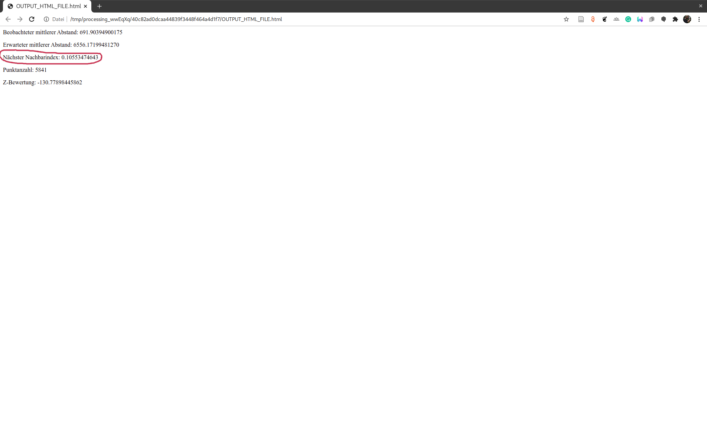

class: title-slide, center, middle
```{r, echo = FALSE}
# https://stackoverflow.com/questions/25646333/code-chunk-font-size-in-rmarkdown-with-knitr-and-latex
def.chunk.hook  <- knitr::knit_hooks$get("chunk")
knitr::knit_hooks$set(chunk = function(x, options) {
  x <- def.chunk.hook(x, options)
  ifelse(options$size != "normalsize", paste0("\\", options$size,"\n\n", x, "\n\n \\normalsize"), x)
})
```

```{r, echo = FALSE, results="asis"}
cat('# ', rmarkdown::metadata$title)
```

```{r, echo = FALSE, results="asis"}
cat('## ', rmarkdown::metadata$subtitle)
```

```{r, echo = FALSE, results="asis"}
cat('### ', rmarkdown::metadata$author)
```

```{r, echo = FALSE, results="asis"}
cat('#### ', rmarkdown::metadata$institute)
```

```{r, echo = FALSE, results="asis"}
cat(rmarkdown::metadata$date)
```
.footnote[
.right[
.tiny[
You can download a [pdf of this presentation](gis_in_archaeology05.pdf).
]
]
]
---
## Leftover from last session

+ Spatial Join did not work last time

+ Reason: Different projections of the involved layers
  + Seem to be a problem in older QGIS versions and/or Windows version!?

+ Solution: Reprojecting the layes

+ to start: Please download this [QGIS Project](data/14c_data.zip) and unzip it to a location of your choice

---
## Calculate mean 14C age per canton (1)

Using GIS, you can excecute statistical procedures and visualise the result in a Choropleth.

(the German term for this is also Choropleth...)


#####Source: http://www.estv2.admin.ch/

---
## Open a QGIS Project

+ open the containing 14c_data.qgz as QGIS Project

+ all layers (if still at the correct relative path) should be loaded immediately

 

---
## Check the CRS

+ first, set your project to the correct CRS (here: EPSG 2056)

+ look to the individual layers to check if these layers have this projection
  + can be done by hovering the mouse over the layer in the layer pane

+ it turns out, the point layer is in EPSG 4326
.center[

]

---
## Reproject Layer

+ Select 'Reproject Layer' from 'Vector > Data managmenent tools'

+ Select your project CRS as target CRS

+ Click on 'Run'

 

---
## Saving reproject layer

+ Currently, the layer is a temporary layer

+ to work with it, it is more save to export it to a shapefile

+ please keep a reasonable file structure
  + eg. separating raw data from processed data
  + eg. separating raster from vector (also best separated)
  + indicate the projection system in file and folder names

 

---
## Calculate mean 14C age per canton (2)

*(Spatial Join)*

To start, we need the cantonal borders and the 14C data and the Toolbox .

The command is 'Join attributes by location (summary)'


---
## Calculate mean 14C age per canton (3)

+ Select the cantonal borders as input layer
+ Select the 14C data as joined layer
+ Select intersection as condition


---
## Calculate mean 14C age per canton (4)

+ in Summary fields, select bp (uncalibrated 14C date) as field
+ in Calculated Summaries, select 'mean' as statistic
+ temporary layer might be ok
+ press 'Run'

 

---
## Calculate mean 14C age per canton (5)

In the Attribute Table, now you can see the mean bp age per canton


---
## Visualise mean 14C age per canton

Now we can color the cantons according to the mean BP age

+ Open the **Properties** of the layer (right click on the layer) and Select there the **Symbology** tab

+ Select 'Graduated' as symbol and Classify the values

+ click on 'OK'

+ Now you should be able to see the age by color

 

---
# Visualising densities
## Heatmaps

* Heatmaps are one of the best visualization tools for dense point data
* Heatmap is an interpolation technique that useful in determining density of input features
* Heatmaps are most commonly used to visualize crime data, traffic incidents etc.
* QGIS has a heatmap renderer that can be used to create an raster from a point layer.

 

.caption[Source: Berner Zeitung; https://archaeologyireland.ie/]

---
## Heatmaps

* technically, Heatmaps are produced using a technique called KDE (Kernel Density Estimation)
* individual points are 'blurred' using most of the time a gaussian distribution (Kernel) with specific parameters
* these 'blurred' points are combined
* the values are represented by a raster

   

.caption[Source: https://www.geodose.com]

---
## KDE - what to consider

* Settings to influence: bandwidth and resulting resolution
* Also, like most processing tools, it operates only reasonable in projected CRS (meter based)

.pull-left[
### Bandwith

Different bandwiths result in more isolated vs. more homogeneous result
]

.pull-right[
### Resolution

higher resolution results in smoother details, but are more memory, space and time consumptive
]

.caption[Source: Chainey 2013]

---
## Heatmap in QGIS (1)

* tool is 'hidden' in the toolbox 
* type 'Heatmap' in the search field
* click on tool

 

---
## Heatmap in QGIS (2)

.pull-left[
* select your point layer
* select the radius (ie. the bandwith) in map units (meters, km, ...)
* select output size (in number of cells or with of pixels)
* advanced options:
  * individual radius and weighting can be taken from attribute table
  * shape of the kernel can be selected
  * output density can be scaled
* export to temporary folder
* add to map if finished
* click on 'Run'
]

.pull-right[

]

---
## Heatmap in QGIS (3)

.pull-left[
### Result

* you should see a grayish blob over your points, lighter where more points are...

### Troubleshooting

+ if you do not see anything, your bandwith might have been to low...
]

.pull-right[

]

---
## Styling heatmaps in QGIS (1)

* heatmaps are best shown using a color ramp in pseudocolor and some transparency
* add layer properties > symbology
* select pseudocolor
* go to transparency and select eg. 50%

 

---
## Styling heatmaps in QGIS (2)

* alter color ramp and transparency until your satisfied
* you might like to add a background map and remove the cantonal borders

.center[

]

* enjoy the result

---
# Density (Point Pattern) Analysis
## Motivation

.pull-left[
* most basically tries to answer the question if data are clustered, regular spaced or random
* uninfluenced spatial processes tend to produce random patterns
* [Complete Spatial Randomness](https://en.wikipedia.org/wiki/Complete_spatial_randomness)
]

.pull-right[

]
.caption[https://gistbok.ucgis.org/]

---

## Archaeological Motivation

.pull-left[
* clustered patterns result from 'attractive' processes
  * if the presence of one object makes other objects more **likely**
  * eg. burial sites: usually, we have burial grounds/areas, so that burials tend to be clustered in the landscape
* regular patterns result from 'repulsive' processes
  * if the presence of one object makes other objects more **unlikely**
  * eg. settlement sites: usually, settlements need some area/hinterland, so that settlements tend to be more regular in the landscape
]

.pull-right[

]
.caption[https://gistbok.ucgis.org/]
---

## Nearest Neighbor Analysis

.pull-left[
**Average Nearest Neighbor (ANN)** measures the average distance of neighboring data points from a given observation. If it is compared with a theoretical random average distance, it tells much about whether data points are clustered or dispersed.

$$NearestNeighbor Dist ance = d(NN) = \frac{\sum^n_{i=1} min(d_{ij})}{N}$$
$$Theoretical Random Distance = d(ran) = 0.5*\sqrt\frac{A}{N}$$
$Nearest Neighbor Index = NNI = \frac{d(NN)}{d(ran)}$
]

.pull-right[

.caption[Average distance of nearest neighbors are shorter in the left. Source: https://towardsdatascience.com]
]

---

## Nearest Neighbor Analysis

.pull-left[
$Nearest Neighbor Index = NNI = \frac{d(NN)}{d(ran)}$

* if the index is **below** 1, the points tend to be clustered
* if the index is **above** 1, the points tend to be regular
* if the index is **around** 1, the points tend to be random
]

.pull-right[

.caption[Average distance of nearest neighbors are shorter in the left. Source: https://towardsdatascience.com]
]
---

## Nearest Neighbor Analysis in QGIS (1)
*(not the most developed function in QGIS yet)*

* Select 'Nearest Neighbor Analysis' from 'Vector > Analytical Tools'
* Select input Layer and press 'Run'

 
---

## Nearest Neighbor Analysis in QGIS (2)
*(not the most developed function in QGIS yet)*

* Result not obviously present...
* Click on Link in the 'Result' pane
* result should pop up in a browser window. Here: Strongly clustered!

 
---

## Nearest Neighbor Analysis in QGIS - try it out
*(not the most developed function in QGIS yet)*

* Load the [this point layer](data/simulated_points.zip) and add it to your map
* Run Nearest Neighbor Analysis
* Is the result consistent with your expectations?

.center[

]

---

## Nearest Neighbor Analysis - Restrictions

.pull-left[
- what we consider regular is strongly scale dependend
- also, some processes might be regular in one scale, while clustered in another
- eg. burials around settlements:
  - Settlements might be regular spaced
  - Burials might be clustered around settlements
  - if we have only the burials, in the landscape the might have a similar structure like the example
]

.pull-right[

]

---

## Neighbor Analysis over multiple scales
### The K function

.pull-left[
The **K-Function** (or **Ripley`s K**) measures distances between all points in space rather than just the neighbors as in ANN. It also helps to understand how clustering or dispersion of data occurs in different distances from its center (the centroid).


.caption[Statistical significance of Ripley’s K function. Source: https://gistbok.ucgis.org]
]
.pull-right[

.caption[K-Function describing how clustering occurs in different scanning horizon from the center. Source: https://towardsdatascience.com]
]

---

## K-function in QGIS

--

There is none...

--

Sorry!

--

But we can implement one ourself:

Using R within QGIS: You might to need to install the 'R Processing Provider' Plugin!

After that, please restart QGIS

**The following will not work if R is not already installed on your computer!**

*(R is a very powerful statistical environment/language! Learn more next semester in my statistics course...)*
---

## Using R in QGIS (1)

* In the Toolbox , click on the R Symbol in the upper toolbar
* Select 'Create New R Script'


---

## Using R in QGIS (2)
.pull-left[
* in the small window, paste in the code on the right side
* save it as 'ripleys_k'


]

.pull-right[
.small[
```{r eval=F}
##Vector Analysis=group
##Layer=vector point
##showplots
library("maptools")
library("spatstat")
points=as.ppp(Layer)
K=Kinhom(points)
kf.env <- envelope(points,
                   Kest,
                   correction = "Ripley")
plot(kf.env)
```
]
]
---

## Our own K-function in QGIS

Now, we can use this function to analyse our layer:

* in the toolbox, find the script under 'R > Vector Analysis > ripleys k'
* Open it, select the simulated points as layer
* 'Run'
* Inspect the result in by clicking the link in the Result Pane

 

---

## Result Ripleys K

* below 50 km Distance, we have clustering
* above 50 km Distance, we have a regular pattern

*(I simulated the data accordingly...)*


 
---
## What We've Covered
--

+ Reprojecting Vector Layers
--

+ Creating Heatmaps
--

+ Nearest Neighbor Analysis to identify global Regularity/Clustering
--

+ Ripleys K function to identify Regularity/Clustering on different spatial scales

*(this is already quite advanced stuff)*

---

## Homework

+ Select a arbitray point layer (the more archaeological the better)
+ Make a heatmap
+ Conduct a Nearest Neighbor Analysis
+ Send me the shapefile of the points, a map of the resulting heatmap and the result of the Nearest Neighbor Analysis

---

class: inverse, middle, center
# Any questions?


.caption[Source: https://www.instagram.com/sadtopographies]

.footnote[
.right[
.tiny[
You might find the course material (including the presentations) at

https://github.com/MartinHinz/gia_hs_2020

You can see the rendered presentations at

http://martinhinz.github.io/gia_hs_2020

You can contact me at

<a href="mailto:martin.hinz@iaw.unibe.ch">martin.hinz@iaw.unibe.ch</a>
]
]
]
