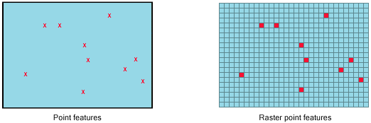
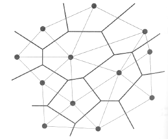

class: title-slide, center, middle
```{r, echo = FALSE}
# https://stackoverflow.com/questions/25646333/code-chunk-font-size-in-rmarkdown-with-knitr-and-latex
def.chunk.hook  <- knitr::knit_hooks$get("chunk")
knitr::knit_hooks$set(chunk = function(x, options) {
  x <- def.chunk.hook(x, options)
  ifelse(options$size != "normalsize", paste0("\\", options$size,"\n\n", x, "\n\n \\normalsize"), x)
})
```

```{r, echo = FALSE, results="asis"}
cat('# ', rmarkdown::metadata$title)
```

```{r, echo = FALSE, results="asis"}
cat('## ', rmarkdown::metadata$subtitle)
```

```{r, echo = FALSE, results="asis"}
cat('### ', rmarkdown::metadata$author)
```

```{r, echo = FALSE, results="asis"}
cat('#### ', rmarkdown::metadata$institute)
```

```{r, echo = FALSE, results="asis"}
cat(rmarkdown::metadata$date)
```

---
<!-- opening shapefile -->
## Let's Get Started
1. [Click this link](data/neolithic_expansion.zip) and download 14C dates for the expansion of the Neolithic
2. Open QGIS
3. Start a new project and Add the layer
4. Add a Background Layer to know where we are...

---

## Interpolation

> is a type of estimation, a method of constructing new data points within the range of a discrete set of known data points. - *wikipedia*

 
> Spatial interpolation is the process of using points with known values to estimate values at other unknown points. - *QGIS Manual*

Example: Temperature of an area, based on the measurements of certain weather stations

.center[

.caption[Source: https://docs.qgis.org]]
---
## Interpolation

> For many characteristics (e.g. temperature, precipitation, population density), the area-wide collection of measured values is not feasible due to financial, personnel, time, etc. constraints. It is therefore necessary to estimate values for unsampled locations from samples. The so-called interpolation is a mathematical solution to the problem of bringing values from point to area. It is based on the assumption that the values at two points are the more similar the closer these points are together. - *https://gis.uster.ch, translation MH*

In Archaeology: We often only have this point information. If we assume that the situation at other points in the vicinity is similar to the one for which we have point data (underlying continuous process), interpolations can help to understand these processes.

.center[

.caption[Source: Fort 2015]]
---
## How to bring points into area?

.pull-left[
1. Every space around a point gets its value
  - either as **raster** or **vector**
  - Gridding, Thiessen-Polygons, Nearest Neighbor
2. Every space between points gets a value that is dependent on both points and its distance to them
  - Triangulation, in GIS most often a **raster**
  - Delauny Triangulation rsp. TIN (Triangulated Irregular Network)
3. The value of every space (pixel) is influenced by all surrounding actual points
  - linearly weighted combination of values from nearby points
  - Inverse Distance Weighted (IDW)
4. more complicated or informed methods...
]
.pull-right[

.caption[Source: https://www.battelleecology.org]
]

---
## Gridding

- Most simple approach
- produces raster grids with 'gaps'

1. create a regular grid over the mapping area
2. for every cell where there is one value, this cell gets the value
3. for every cell where there are multiple values, this cell gets the mean value
4. every other cell remains empty

 
.caption[Source: https://desktop.arcgis.com/]

Not very convenient for areal analysis...
---
## Gridding in QGIS

1. Click on 'Raster > Conversion > Rasterize (Vector to Raster)'
2. Select the Input Layer
3. Select 'CALBP' as the field that should be rastered
4. Select 'georeferenced units' as raster units
5. Select 100000 m as pixel size for width and height
6. Select the Extend of the point layer as extend for the resulting raster
7. Click on 'Run'

 
---
## Gridding in QGIS result

- you should see a raster covering the points
- pixel size defines the resolution
- if you change symbology to pseudocolor, it already looks reasonable

 

---
## Thiessen Polygons

.pull-left[
> A Voronoi diagram, also called Thiessen polygons or Dirichlet decomposition, is a decomposition of space into regions determined by a given set of points in space, here called centres. - german wikipedia, translated

Technique to estimate the area affected mainly by a point within a set of points

1. connect all neighbouring points
2. draw a orthogonal line at the middle of the connections
3. stop, when you meet other lines
]

.pull-right[


]
---
## Thiessen Polygons in QGIS

1. Click on 'Vector > Geometry tools > Voronoi polygons'
2. (You could define an additional buffer around your working area...)
3. Just click on 'Run'

 
---
## Thiessen Polygons in QGIS result

.pull-left[
The result is are polygons around your points that contain all the values from the attribute table of the points.

You can check by looking in the attribute table

You can use symbology > graduated to use the CALBP field for colorising

The result is this piece of art to the right, blue means early, red means late neolithisation

Of course, transparency is a nice option here, too.
]

.pull-right[


]
---
## Thiessen Polygons as Raster > Nearest Neighbor Interpolation

You can also create a raster version quite easily.

Either you raster the Thiessen Polygons...


Or you use the Nearest Neighbor Interpolation (not to mix up with the analysis)

---
## Nearest Neighbor Interpolation in QGIS

1. Select 'Raster > Analysis > Grid (Nearest Neighbor)'
2. Select the input layer and specify the field CALBP as 'z value from field'
3. click on 'Run'

 

---
## Nearest Neighbor Interpolation in QGIS Result

The resulting raster is equivalent to the Thiessen Polygon Solution... only as raster

 
---
## TIN (Triangulated Irregular Network)

---
## Inverse Distance Weighted (IDW)

---
## Contours

---
class: inverse, middle, center
# Any questions?

 
.footnote[
.right[
.tiny[
You might find the course material (including the presentations) at

https://github.com/MartinHinz/gia_hs_2020

You can see the rendered presentations at

http://martinhinz.github.io/gia_hs_2020

You can contact me at

<a href="mailto:martin.hinz@iaw.unibe.ch">martin.hinz@iaw.unibe.ch</a>
]
]
]
