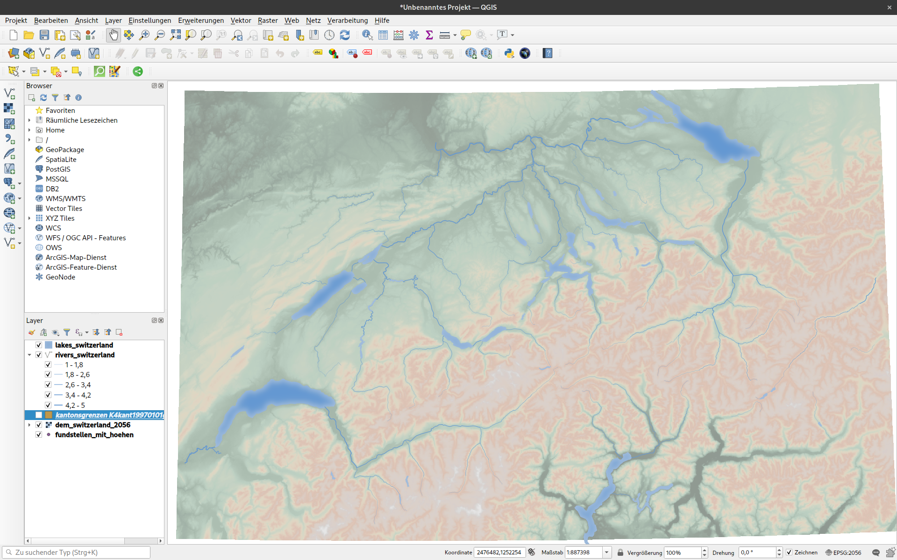
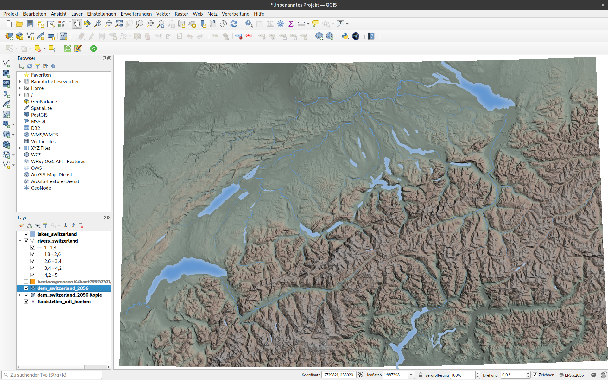
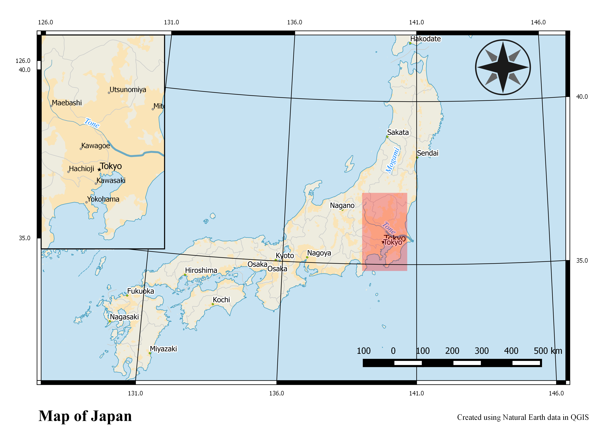
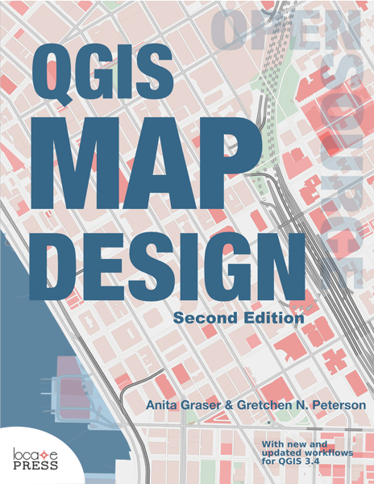

class: title-slide, center, middle
```{r, echo = FALSE}
# https://stackoverflow.com/questions/25646333/code-chunk-font-size-in-rmarkdown-with-knitr-and-latex
def.chunk.hook  <- knitr::knit_hooks$get("chunk")
knitr::knit_hooks$set(chunk = function(x, options) {
  x <- def.chunk.hook(x, options)
  ifelse(options$size != "normalsize", paste0("\\", options$size,"\n\n", x, "\n\n \\normalsize"), x)
})
```

```{r, echo = FALSE, results="asis"}
cat('# ', rmarkdown::metadata$title)
```

```{r, echo = FALSE, results="asis"}
cat('## ', rmarkdown::metadata$subtitle)
```

```{r, echo = FALSE, results="asis"}
cat('### ', rmarkdown::metadata$author)
```

```{r, echo = FALSE, results="asis"}
cat('#### ', rmarkdown::metadata$institute)
```

```{r, echo = FALSE, results="asis"}
cat(rmarkdown::metadata$date)
```
.footnote[
.right[
.tiny[
You can download a [pdf of this presentation](gis_in_archaeology_08.pdf).
]
]
]
---
# Choosing a Base Map
--

+ Think about what someone reading your map needs to see for context
--

+ Think about how the base map interacts with the data on your map

---

# Base Maps - Hierarchy
--

+ If your data is the most important part of the map, make sure it looks more important than the base map
--

+ Avoid base maps that strongly emphasize features that aren't relevant on your map

---

# Base Maps - Colors
--

+ Choose base maps with colors that complement the colors on your map
--

+ The contrast between the color on your map and the color on the base map should be enough to make your layers clearly visible

---

## Options for Background Maps
### Stamen

Work also for small scale

```{r echo=FALSE}
library(mapview)
library(leaflet)

library(magrittr)
```

.pull-left[
TonerBackground
```{r echo=FALSE}
leaflet() %>% addProviderTiles("Stamen.TonerBackground") %>% setView(7.5, 47, zoom = 8)
```
]

.pull-right[
TerrainBackground
```{r echo=FALSE}
leaflet() %>% addProviderTiles("Stamen.TerrainBackground") %>% setView(7.5, 47, zoom = 8)
```
]
---

## Options for Background Maps
### Esri

More natural Variants, large scale

.pull-left[
WorldTerrain
```{r echo=FALSE}
leaflet() %>% addProviderTiles("Esri.WorldTerrain") %>% setView(7.5, 47, zoom = 8)
```
]

.pull-right[
WorldPhysical
```{r echo=FALSE}
leaflet() %>% addProviderTiles("Esri.WorldPhysical") %>% setView(7.5, 47, zoom = 8)
```
]
---

## Options for Background Maps
### Esri

More neutral Variants, large scale

.pull-left[
WorldShadedRelief
```{r echo=FALSE}
leaflet() %>% addProviderTiles("Esri.WorldShadedRelief") %>% setView(7.5, 47, zoom = 8)
```
]

.pull-right[
WorldGrayCanvas
```{r echo=FALSE}
leaflet() %>% addProviderTiles("Esri.WorldGrayCanvas") %>% setView(7.5, 47, zoom = 8)
```
]

---

## Options for Background Maps
### CartoDB

Good for man made features

.center[
Positron
```{r echo=FALSE}
leaflet() %>% addProviderTiles("CartoDB.Positron") %>% setView(7.5, 47, zoom = 8)
```
]


---
## Building a background map from scratch

If there is no Basemap according to our needs, we have to build on on our own...

* Political borders (if necessary)
* Waterbodies
* Mountains

---
## Political borders (if necessary)

* depends on the area and scale you are working with
* good source for Switzerland: https://map.geo.admin.ch
* in general: https://www.naturalearthdata.com

 
.caption[Source: https://map.geo.admin.ch; https://www.naturalearthdata.com]

---
## Waterbodies

.pull-left[
large scale: 
* Natural Earth Data > Physical
  * Ocean
  * Rivers + lake centerlines
  * Lakes + Reservoirs
* World wide + Europe supplement
]

.pull-right[
small scale:
* depends on your region and scale
* [CCM River and Catchment Database, version 2.1 (CCM2)](https://ccm.jrc.ec.europa.eu/php/index.php?action=view&id=24) for Europe
]

 
.caption[Source: https://www.naturalearthdata.com; https://ccm.jrc.ec.europa.eu]

---
## Mountains -> DEM (Digital Elevation Model)

.pull-left[
* DEM: a computer based representation of elevation data 
* Mostly available as raster data, sometimes as TIN
* large scale: Mostly from remote (satellite) data
* small scale: areal photography or measurements, or even ground based surveys
* methods
  * Radar
  * LiDAR
  * Structure from motion
  * ...
  
]

.pull-right[

.caption[Sources: https://crisp.nus.edu.sg; https://desktop.arcgis.com]
]

DEM can come in EPSG 4326 (WGS 84 lat/lng).

Then might be necessary to reproject the DEM to a projected (meter based) CRS. We cover this in the next session...

---
## Mountains

.pull-left[
rendered: 
* Natural Earth Data > Raster
  * Gray Earth
  * Shaded Relief
  

]

.pull-right[
DEM:
* depends on your region and scale
* GMTED2010 (https://topotools.cr.usgs.gov/gmted_viewer/viewer.htm) 7.5 arc second resolution (~ 225 m along the equator)
* SRTM (e.g. https://dwtkns.com/srtm30m) 3 arc second resolution (~ 90 meters along the equator)
* ASTER (e.g. https://search.earthdata.nasa.gov/) 3 arc second resolution (~ 30 meters along the equator)
* TanDEM-X (90 m after registration, 12 m only with project submission)
* LiDAR
]
---
## Lets put it together

- Download the [Bernese Archaeological sites](data/fundstellen_mit_hoehen.zip)
- Download the [Kantonal Borders of Switzerland](data/kantonsgrenzen.zip)
- Download the Waterbodies
  - [Rivers](data/rivers_switzerland.zip)
  - [Lakes](data/lakes_switzerland.zip)
- Download the [DEM for the Kanton of Bern](data/dem_switzerland_2056.tif) (GMTED2010, 7.5 arc seconds)
- Start QGIS and add all layers

All not best possible resolution, but they will serve their purpose

.right[

]
---
## Your Map will probably look like this - 

after you arranged the layers in a meaninful order...


---
## Styling Lakes topo water

* Right Click on the layer
* Properties > Symbology
* Most simple: Select topo water from the suggested styles

 
.caption[Source: Lakes symbology topo water + result.]

---
## Styling Lakes shapeburst

* More elaborated: Select shapeburst from layer type
* select a different (darker) shade of blue as second color
* set a distance (eg. 3 mm)
* add a blur (eg. 50%)
* Maybe already too fancy for scientific maps!?

 
.caption[Source: Lakes symbology topo water + result.]
---
## Styling Rivers topo hydrology

* Right Click on the layer
* Properties > Symbology
* Most simple: Select topo hydrology from the suggested styles

 
.caption[Source: Rivers symbology topo hydrology + result.]
---
## Styling Rivers size based

More advanced: Sometimes you have informations about the size of rivers. Quite often it is in the form of [Strahler number](https://en.wikipedia.org/wiki/Strahler_number). We can use this information to specify the river width.

.pull-left[
* Select 'Graduated' as style option
* Select 'Size' as method
* Select 'stream_ord' as value
* Select sizes and Classify (Best with 'Equal Interval')
]

.pull-right[

]

 
.caption[Source: Rivers symbology graduated + result.]

---
## Visualisation of Topography

We need a DEM (Digital Elevation Model)

* Either: Hillshade combined with color ramp visualisation of elevation (more colorful)
* Or: Hillshade combined with polygon  (more 'scientific')

.center[
 
.caption[Source: http://https://www.naturalearthdata.com/]
]

---
## Topographic color ramp

For this, we make our polygon layer invisible

* Select Properties > Symbology from the DEM layer
* Select Pseudocolor
* Select 'Create new color ramp'
* Select 'catalog: cpt-city' from the following dialog
* There, under Topography, select a color ramp of your choice
* "Classify", "Apply" and "OK"

.center[
 
]
---
## Topographic color ramp Result

Not bad, but a bit flat...

.center[

]

We need to add hill shading!

---
## Hillshading

> Hillshading is a technique used to create a realistic view of terrain by creating a three-dimensional surface from a two-dimensional display of it. Hillshading creates a hypothetical illumination of a surface by setting a position for a light source and calculating an illumination value for each cell based on the cell's relative orientation to the light, or based on the slope and aspect of the cell. - http://www.geography.hunter.cuny.edu

.center[
 
.caption[Source: http://www.geography.hunter.cuny.edu]
]

---
## Hill Shading

We need the DEM Raster layer twice: once for the color, once for the hillshading

* Right click on the layer and dublicate
* Right click on the upper copy and select Properties > Symbology
* Select 'Hill Shading' as Visualisation
* You can change angle of sunlight
* Select 'Multi-Directional' and 'Multiply' as Blending Mode

.center[
 
]
---
## Hill Shading Result

That looks rather nice!

It also looks nice if we put the vectors below the hillshade and make the colored DEM invisible.

.center[

]
---
## Overview Map

* more than one map in the map layout
* often necessary to indicate the general location of the mapped area
* can also be 'multi staged'
* can also be a detailed map...

.center[

.caption[Examples of Overview and Detail map layout. Source: http://http://www.qgistutorials.com]
]

---
## Create an Overview Map in QGIS (1)

* Add another Worldwide Basemap layer to your map, eg. ESRI Gray light
* Start the Print Composer
* Add the current map
* Select 'Lock Layer'

.center[

]

---
## Create an Overview Map in QGIS (2)

* Go back to the main window
* Zoom to a europe wide extend
* remove all layers except the background layer
* Go back to the Print Composer Window
* Add another map eg. to the left upper corner

.center[

]

---
## Create an Overview Map in QGIS (3)

* Select the small map
* In the Elements Tab, select Overview
* click on the + item
* Select map 1 as map frame

You might also like to frame the minimap

* Find 'Frame' in the element properties and check the box

.center[

]

---

# What We've Covered
--

+ Different Basemaps
--

+ Getting Vector and Raster Data
--

+ Styling Water Bodies
--

+ Getting and Styling DEMs
--

+ Hillshading
--

+ Making an Overview Maps

---
## More Map Design with QGIS

.pull-left[
Gretchen Peterson and Anita Graser QGIS Map Design, 2nd Edition (Locate Press, 2018), pp. 200 ISBN: 978-0989421751.
]

.pull-right[

]

---

# Homework

**No Homework!**


---
class: inverse, middle, center
# Any questions?


.caption[Source: https://www.instagram.com/sadtopographies]

.footnote[
.right[
.tiny[
You might find the course material (including the presentations) at

https://github.com/MartinHinz/gia_hs_2020

You can see the rendered presentations at

http://martinhinz.github.io/gia_hs_2020

You can contact me at

<a href="mailto:martin.hinz@iaw.unibe.ch">martin.hinz@iaw.unibe.ch</a>
]
]
]
