class: title-slide, center, middle
```{r, echo = FALSE}
# https://stackoverflow.com/questions/25646333/code-chunk-font-size-in-rmarkdown-with-knitr-and-latex
def.chunk.hook  <- knitr::knit_hooks$get("chunk")
knitr::knit_hooks$set(chunk = function(x, options) {
  x <- def.chunk.hook(x, options)
  ifelse(options$size != "normalsize", paste0("\\", options$size,"\n\n", x, "\n\n \\normalsize"), x)
})
```

```{r, echo = FALSE, results="asis"}
cat('# ', rmarkdown::metadata$title)
```

```{r, echo = FALSE, results="asis"}
cat('## ', rmarkdown::metadata$subtitle)
```

```{r, echo = FALSE, results="asis"}
cat('### ', rmarkdown::metadata$author)
```

```{r, echo = FALSE, results="asis"}
cat('#### ', rmarkdown::metadata$institute)
```

```{r, echo = FALSE, results="asis"}
cat(rmarkdown::metadata$date)
```
.footnote[
.right[
.tiny[
You can download a [pdf of this presentation](gis_in_archaeology14.pdf).
]
]
]
---
## Batch Processing and Automation

Quite often, GIS Tasks do not involve only one processing step for one dataset:

* Often, multiple files have to be processed the same way
* or, processing might involve multiple steps, that you might like to redo for several datasets

Two tools in QGIS might help in these situations:

* Batch Processing
* the Processing Modeler

---
## Batch Processing

.pull-left[
* production of a "batch" of multiple items at once, one stage at a time

Typical tasks in general:

* Performing bulk operations on digital images such as resizing, conversion, watermarking, or otherwise editing a group of image files.
* Converting computer files from one format to another

Use cases in GIS:
* if the same tool has to be applied to different layers
* typically, all layers have to be of the same kind (raster or vector)
]

.pull-right[
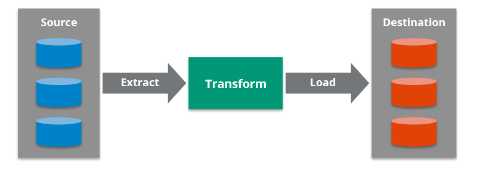
.caption[Batch Processing of multiple items with the same algorithm. Source: https://hazelcast.com]
]

---
## Batch Processing
### Example: Crop Vector Files to the same extend

.pull-left[
Remember the session on making a basemap from scratch?

We used Rivers and Lakes from the geo.admin.ch portal, already croped to Switzerland.

to achieve this with the Natural Earth datasets, we need to load:

* the [worldwide rivers](data/ne_10m_rivers_lake_centerlines.zip) and the [european supplement](data/ne_10m_rivers_europe.zip) data
* the [worldwide lakes](data/ne_10m_lakes.zip) and the [european supplement](data/ne_10m_lakes_europe.zip) data
]

.pull-right[
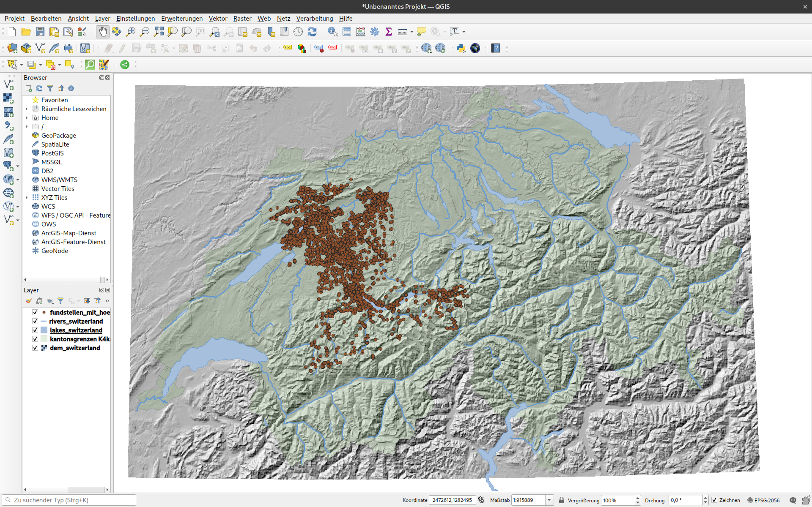
]

Than we have to crop 4 Layers to the [extend of Switzerland](data/schweiz.zip).

**Please load all the data and add them to a new QGIS Project!**
---
## Batch Processing
### Example: Crop Vector Files to the same extend

This involve **four** times the same operation: cropping the layer to the extend of Switzerland


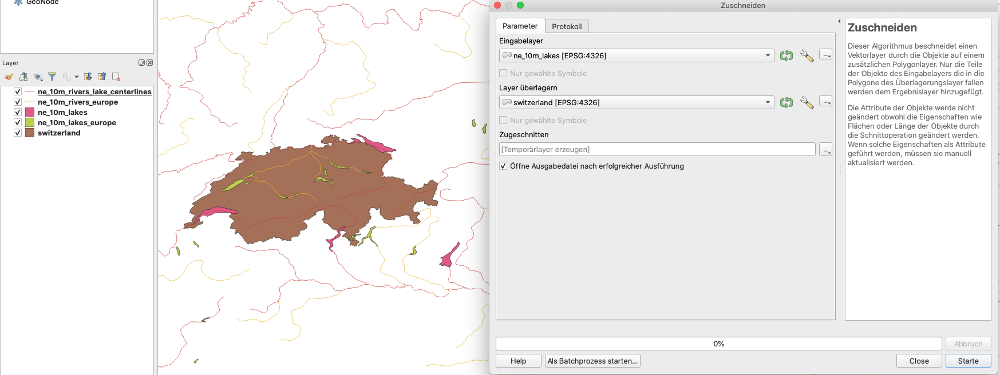

With Batch processing, we can do this in one run

---
## Batch Processing
### Example: Crop Vector Files to the same extend
.pull-left[
* If not already there, please open the Toolbox 
* Search for Crop (Zuschneiden)
* Right Click on the tool and select 'Execute as Batch Process' ('Als Stapelprozess ausführen')

Next step is to select the source

* Click on 'Autofill', and select 'From Open Layers'
* Select all layers, that the operation should apply to, and click on OK
]

.pull-right[
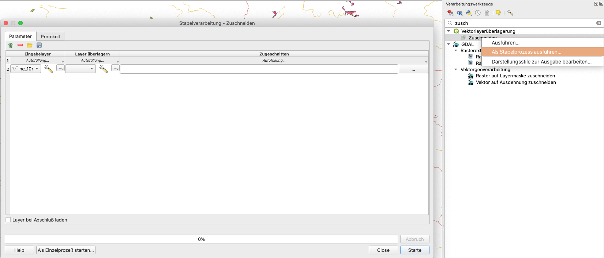
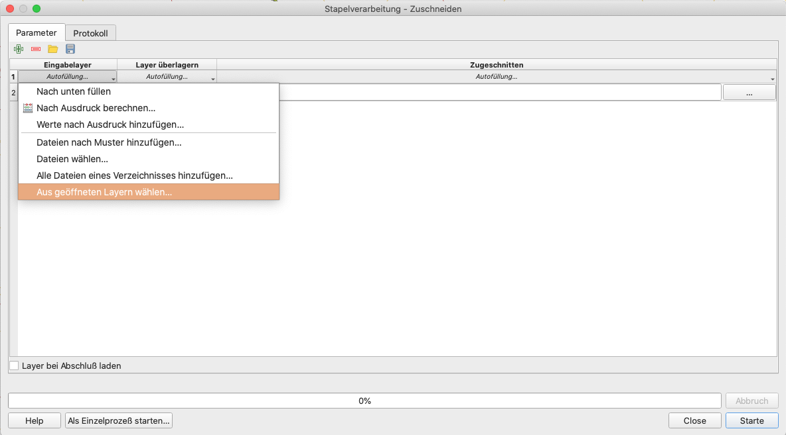
]

---
## Batch Processing
### Example: Crop Vector Files to the same extend
.pull-left[
The next step is to select the parameters. This might look different in different tools. For Crop, we have only to select the overlay layer.

* In the first row, select the switzerland-layer as overlay
* Click on Autofill, and select 'Fill down'
* Right Click on the tool and select 'Execute as Batch Process' ('Als Stapelprozess ausführen')
]

.pull-right[
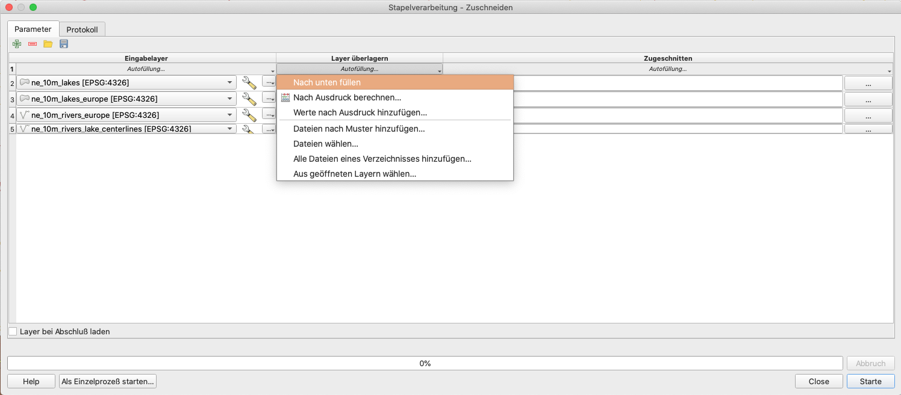
]
---
## Batch Processing
### Example: Crop Vector Files to the same extend

.pull-left[
Finally, we have to select the storage location of the processed files

* In the first row, click in the column 'Cropped' on the three dots (...)
* In the file dialog, select the correct folder, and write as filename only 'clipped_'
  * this will be prepended to all file names
* Click on 'Save', a new window will appear with the autofill-settings
* Select 'Fill with Parameter values' as Autofill mode and 'Input layer' as 'Parameter to use'
]

.pull-right[

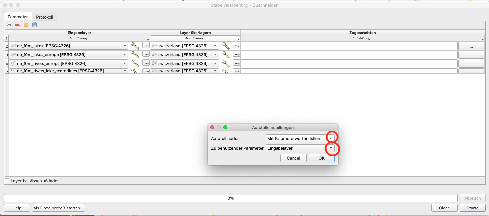
]
---
## Batch Processing
### Example: Crop Vector Files to the same extend

.pull-left[
Now we are good to go. Make sure to check 'Load Layers on completion'. The resulting window should look like the one on this slide

Click on 'Run', now all the layers should be processed with the same algorithm at once.

The result should be four layers, cropped to switzerland, in one go.
]

.pull-right[
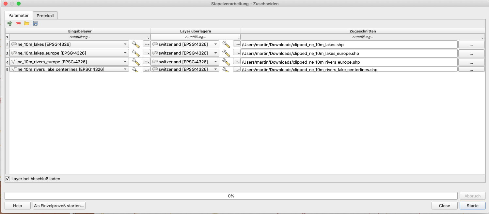
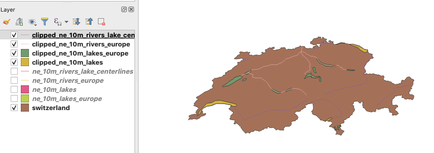
]
---
## GeoPackage
.pull-left[
Until now, we worked with zipfiles for moving around shapefile-layers. There is a more convenient way to do this, that is also supported by ArcGIS and other software: GeoPackage.

> A GeoPackage (GPKG) is an open, non-proprietary, platform-independent and standards-based data format for geographic information system implemented as a SQLite database container. Defined by the Open Geospatial Consortium (OGC) with the backing of the US military and published in 2014, GeoPackage has seen wide widespread support from various government, commercial, and open source organizations. - wikipedia
] 
.pull-right[

.caption[Source:https://www.geopackage.org]
] 
---
## Packing files into an GeoPackage
.pull-left[
* If not already there, please open the Toolbox 
* Search for 'pack', and select the 'Package layers' ('Layer verpacken') tool
* In the dialog, select the three dots for Input Layer
* Select all layers that should be part of the GeoPackage and click on OK
* Select the location and name of the GeoPackage as Destination
* Click on Run
* In your filesystem there should be a new file that holds all layers, which now can be transfered imported into QGIS (or other GIS) at once
]

.pull-right[
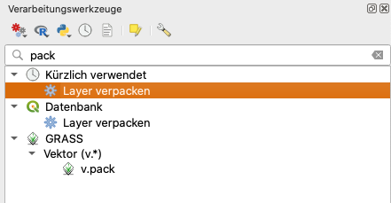
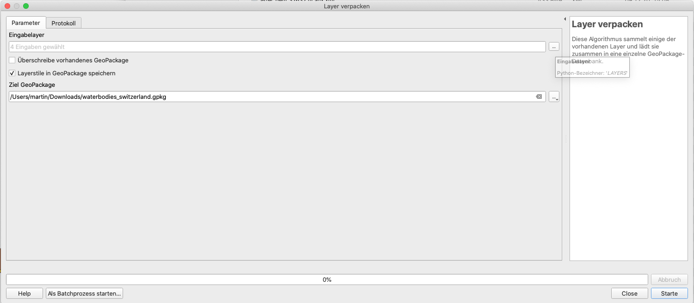

] 

---
## Automating Complex Workflows using Processing Modeler
.pull-left[
* GIS Workflows typically involve many steps
* the intermediate output of one process is often the input of the next
* changing input data or parameters make it necessary to run through the entire process again
* the graphical modeler of QGIS helps to define workflows that can be run with a single invocation
* these workflows can also run as batch processing over a large number of inputs
]

.pull-right[
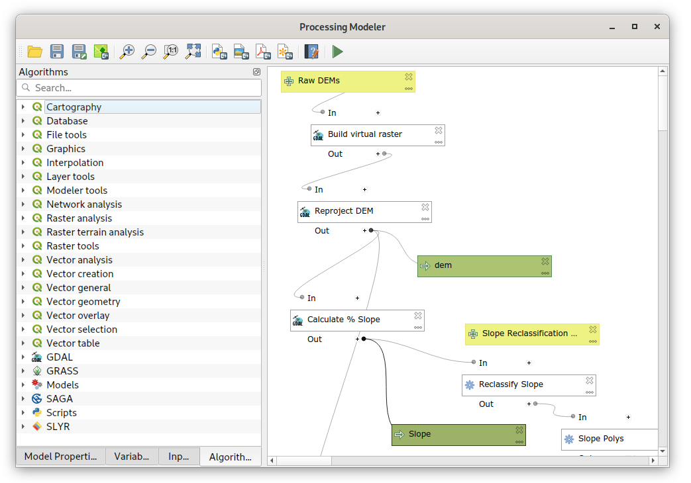
.caption[Example of an automated QGIS workflow. Source: https://north-road.com]
]
---
## Automating Site Catchment calculation

Remember calculating Site Catchments? This involved the following steps:

Input data: [DEM](data/srtm_2056_cut.tif) and [site point vector layer](data/start.zip)

(**Please download the layers and extract (!) the vector Layer**)

1. Calculating the friction cost layer with 0 additional costs
2. Calculating the walking time surface layer using r.walk.points from GRASS
3. Calculating the 1h walking time extend using the Contour Lines tool from SAGA
4. Converting the resulting line to a polygon representing the 1h catchment

.center[
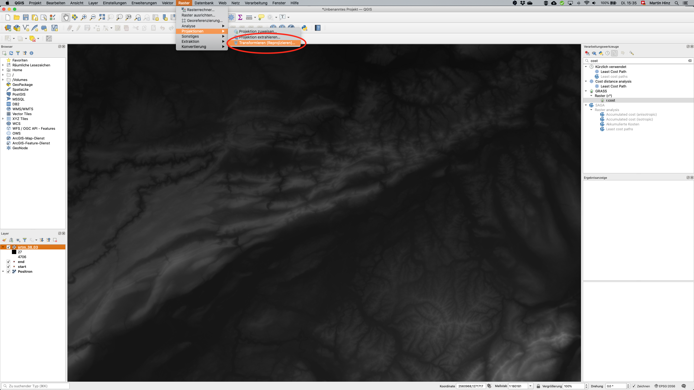 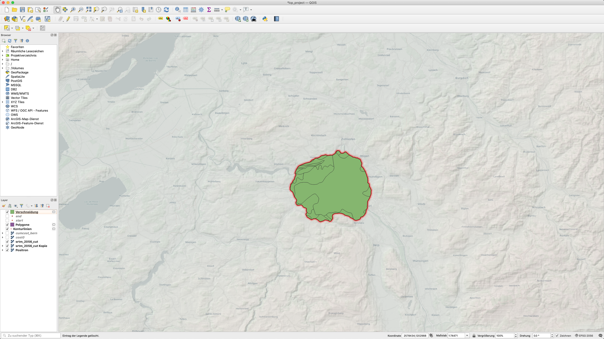
] .caption[From DEM and site to Catchment is a long way with several steps!]

---
## Automating Site Catchment calculation
### using the Processing Modeler

First, make a new QGIS Project and add the DEM and the site layer (the extracted shp-file) to your project.

Than, start the Processing Modeler tool.

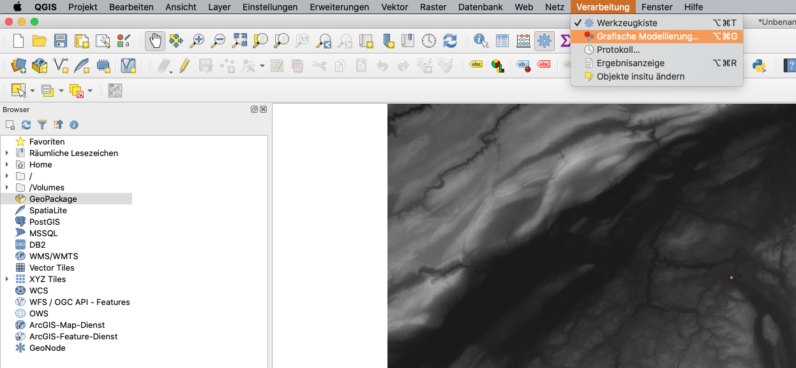
---
## Automating Site Catchment calculation
### using the Processing Modeler

.pull-left[
Here, we define the workflow and the interdependencies of the different processing steps. At first we have to define the input data. We use entities to represent our real data. We start with the raster file.

* Select in the 'Input pane' the option 'Raster layer'
* Name it 'DEM', because it will represent whatever DEM the user will later add as input data
* the checkbox for 'mandatory' is already checked. We definitely will need a raster input, so we leave it checked.
]

.pull-right[
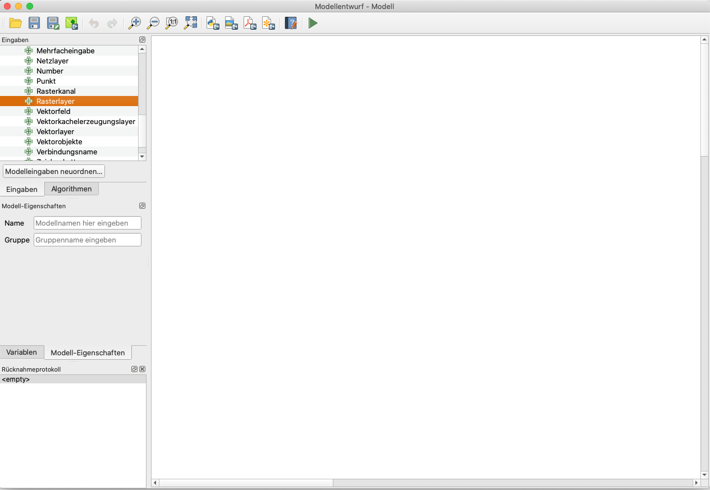
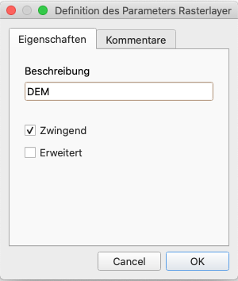
]
---
## Automating Site Catchment calculation
### using the Processing Modeler

.pull-left[
Next, we do the same with the vector input layer for the site layer.

* Select in the 'Input pane' the option 'Vector layer'
* Name it 'Site', because it will represent whatever site layer the user will later add as input data
* Select 'Point' as geometry type, since only point data are meaningful here
* the checkbox for 'mandatory' is already checked. We definitely will need a raster input, so we leave it checked.

After clicking OK, your window should look like the one on the right -> 
]

.pull-right[
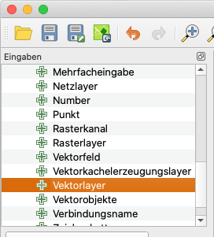
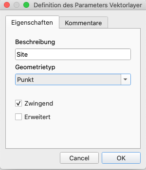
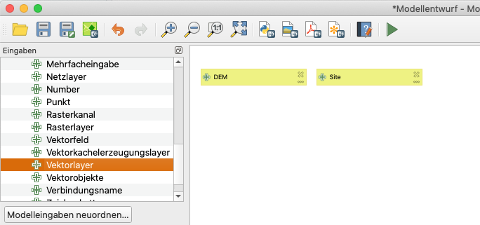

]

---
### using the Processing Modeler

.pull-left[
Next, we add our first algorithm. Here we calculate the friction cost layer, that should hold only 0 in each cell. We use the raster calculator.

* Switch from Inputs to Algorithms
* Search for 'Rastercalculator' and double click it to open
* rename it 'calculate 0 raster'
* in the 'Expression' pane enter 'DEM@1 - DEM@1' (to calculate 0)
* Click on the drop down field in from of 'Reference layer' and select 'Model input', than select the DEM in the right drop down field
* Click on OK
]

.pull-right[
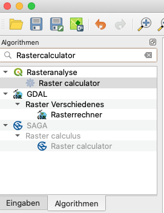
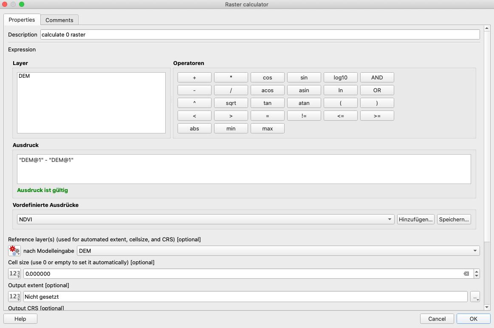
]
---
## Automating Site Catchment calculation
### using the Processing Modeler

.pull-left[
Your Model Window should now look like this:

* a small line connects the input DEM with the first algorithm
]
.pull-right[
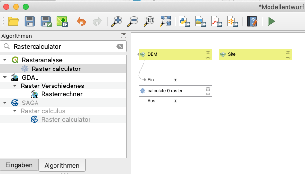
]
---
## Automating Site Catchment calculation
### using the Processing Modeler

Next step is to run r.walk.points

* Search under Algorithms for that tool and double click it
* For the Elevation Raster, select 'Model Input' and 'DEM'
* For the Friction Cost Raster ('Reibungskosten') select 'Algorithm Output' and 'calculate 0 raster'
* For the Start point, select 'Model Input' and 'Site'
* Click on 'OK'

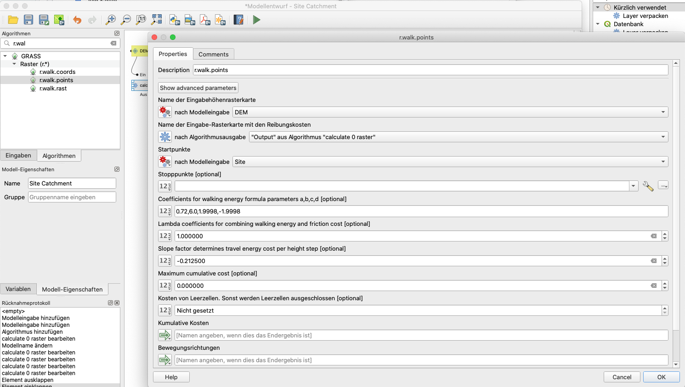
---
## Automating Site Catchment calculation
### using the Processing Modeler

.pull-left[
Your Model Window should now look like this:

* a small line connects the input DEM with the first algorithm
* three small lines connect r.walk.points with all the inputs it gets from the input layers and the calculation of the raster with 0 friction costs
]
.pull-right[
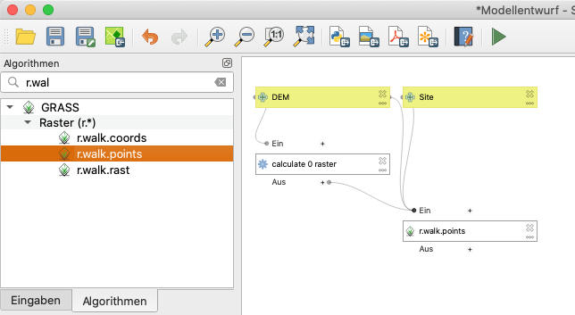
]
---
## Automating Site Catchment calculation
### using the Processing Modeler

Next, we calculate the 1h (3600 seconds) Contour using the SAGA GIS Contour tool

* Seach for contour and double click the SAGA tool 'Contour Lines'
* As Raster, select 'Algorithm Output' and 'Cumulative Costs from Algorithm "r.walk.points"'
* As 'Support point type' select 'x,y'
* Set Minimum and Maximum to 3600 (= 1h)
* Click on OK

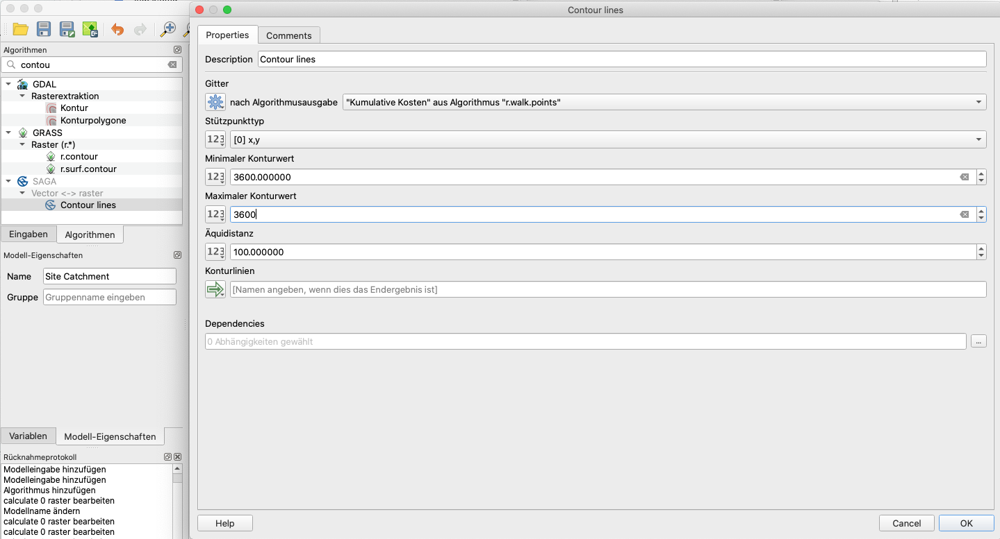
---
## Automating Site Catchment calculation
### using the Processing Modeler

As last step, we convert the resulting line layer to a polygon layer

* Search for 'Lines to Polygon' and double click the tool
* Select 'Contour Lines from algorithm "Contour Lines"' as input
* **This time, write 'Catchment' as the name of the resulting layer. This will produce an output layer that than can be added to the map**
* Click on OK

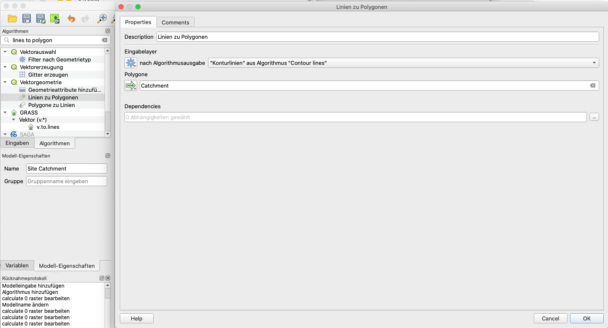
---
Your Final Model should look like this:

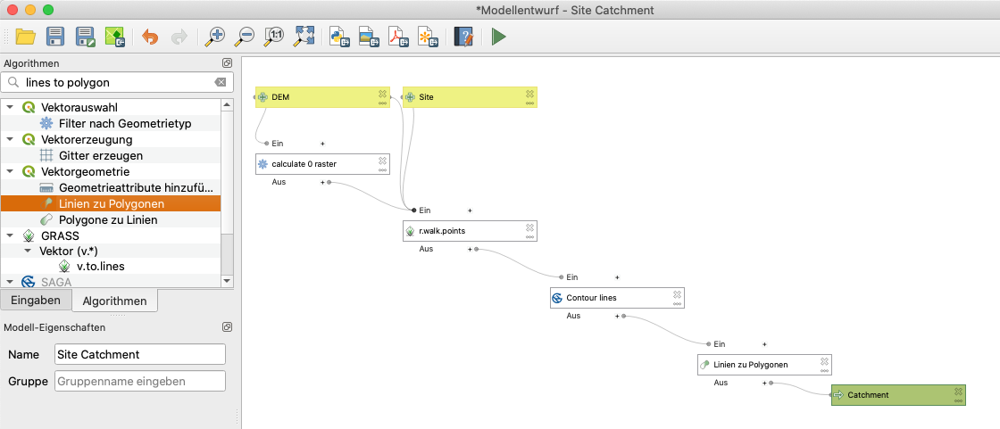
You now name the model eg. 'Site Catchment', click on the Save icon and save it eg. as 'catchment'. Do not change the location suggested, it is the standard location where QGIS will find the model (workflow) again.

Than you can close the window.
---
## Automating Site Catchment calculation
### using the Processing Modeler
.pull-left[
In the toolbox, you will find now 'Models' as an option, and beneath it, your 'Site Catchment' model.

Click to run!
]

.pull-right[
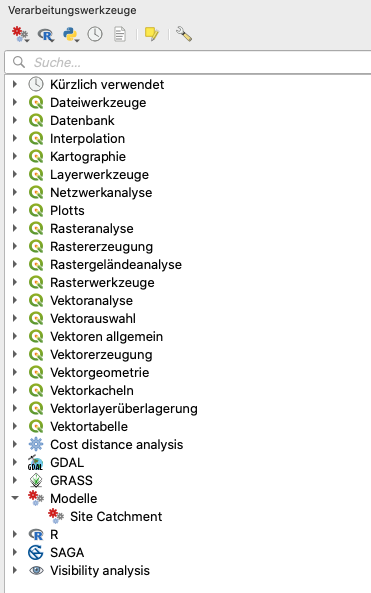
]
---
## Automating Site Catchment calculation
### using the Processing Modeler

.pull-left[
* Select the 'srtm_2056_cut' layer as DEM
* Select the 'start' layer as Site
* Click on 'Run'

Now, the whole workflow will be executed in one go. If you change the input layers, you easily and fast can recalculate catchments for different sites!
]

.pull-right[
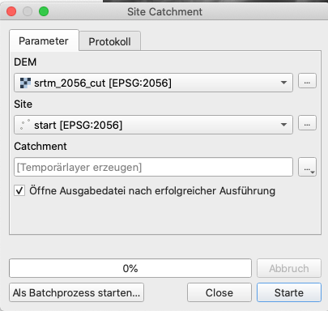
]

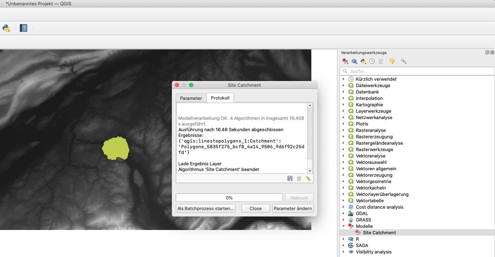
---
# What We've Covered
--

+ Batch Processing of one algorithm applied on multiple layers
--

+ Exporting GeoPackages
--

+ Creating Workflows (Models) to easily repeat multiple processing steps
---
# Course Feedback

---
class: inverse, middle, center
# Any questions?


.caption[Find more Sad Topographies at Sad Topographies...]

.footnote[
.right[
.tiny[
You might find the course material (including the presentations) at

https://github.com/MartinHinz/gia_hs_2020

You can see the rendered presentations at

http://martinhinz.github.io/gia_hs_2020

You can contact me at

<a href="mailto:martin.hinz@iaw.unibe.ch">martin.hinz@iaw.unibe.ch</a>
]
]
]
